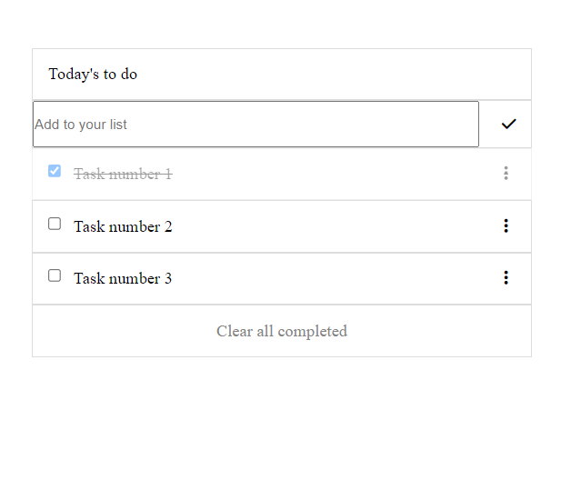

# To-do list app

> This browser app can help you to keep track of your daily tasks and don't worry about keeping open your browser because this app uses your local storage to keep all changes up to date.

## Built With

- HTML, css and Javascript
- Webpack

## Live Demo

[Live Demo Link](https://luis-pomare.github.io/toDoList/dist)

## Getting Started

You must add your pending tasks by typing them into the top-side text field. Once you click the add button you will see the added task in the list.
You can mark a task as completed by checking its check box. If you want to delete all the completed tasks you can click the "Clear all completed" button at the bottom of the page or you can remove them one by one in the right-side menu.

To run this repo in your local machine, you must clone it in your terminal (Or git bash) by using the command **`git clone`** plus the **SSh key\*** that is in the code tag above. Once you have it on your local machine you must run the **"live server"** extension from **"VS code"** over the **"index.html"** file present in the **"dist"** folder of this repo.

## Authors

👤 **Luis pomare**

- GitHub: [@luis-pomare](https://github.com/luis-pomare)
- Twitter: [@LuisPomare1](https://twitter.com/LuisPomare1)
- LinkedIn: [luis-pomare-388116225](https://www.linkedin.com/in/luis-pomare-388116225/)

## Show your support

Give a ⭐️ if you like this project!

## 📝 License

This project is [MIT](./MIT.md) licensed.
